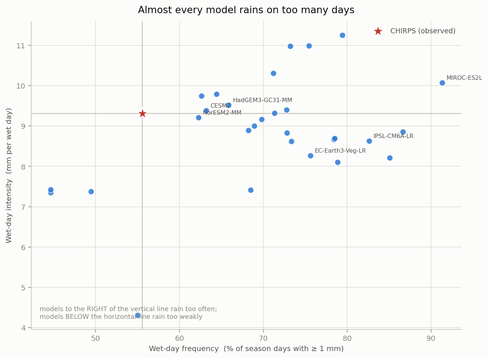
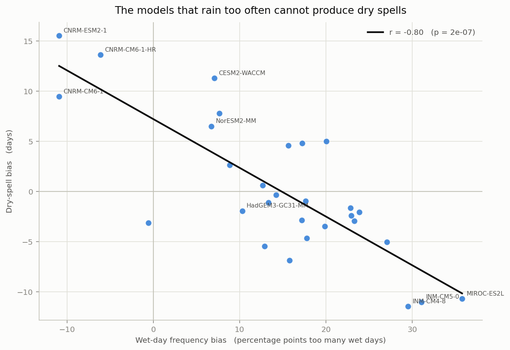
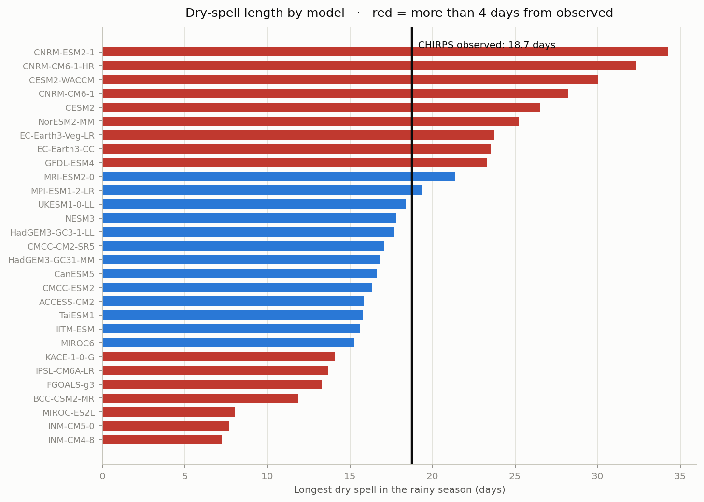
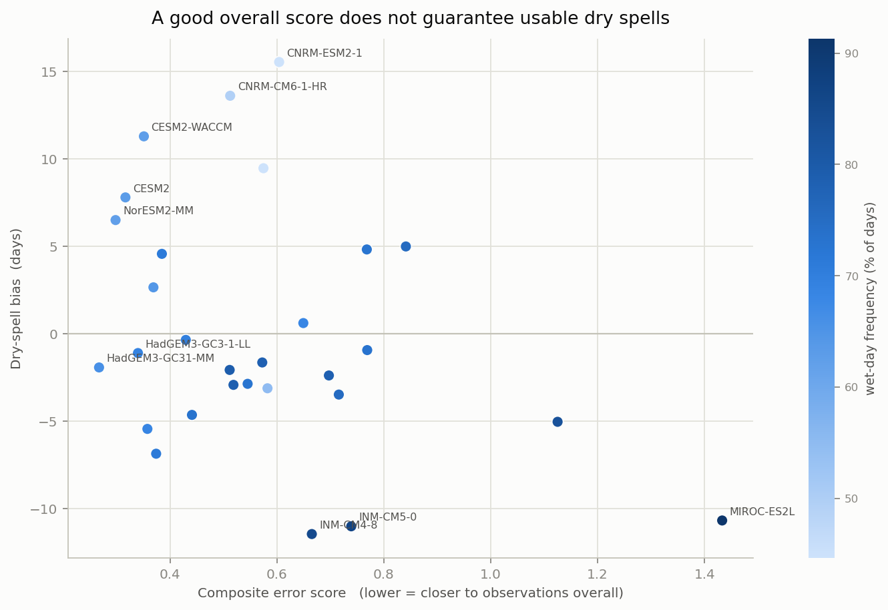
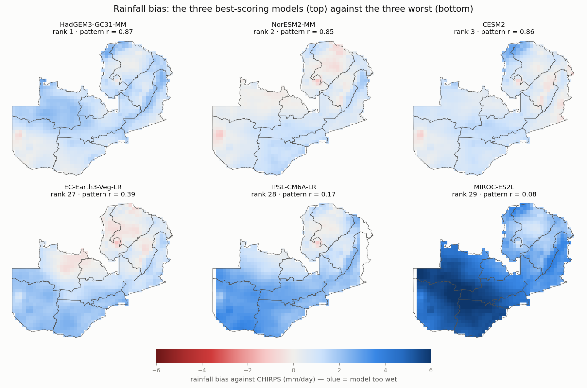

# Can CMIP6 models reproduce Zambia's rainy season?

*Evaluation of 29 CMIP6 models against CHIRPS observations, October–March, 1984/85–2013/14.
Third of three companion studies — see [Related work](#related-work).*

The [observational rainfall study](https://github.com/nephatmwanza/zambia-rainfall-extremes)
found that what matters for Zambian agriculture is not the seasonal total but the **dry spell
inside the season**: a three-week gap in January fails a maize crop in a year of entirely
normal rainfall.

So before any climate model is used to plan Zambia's future, one question comes first — **can
these models reproduce the present?**

Mostly they cannot. And the reason turns out to be specific, measurable, and the same in
almost every model.



*Each dot is one model; the star is the observed climate. Almost every model sits to the right
of it — raining on far more days than actually happens.*

---

## The finding

**25 of 29 models rain on too many days.** Zambia's rainy season is wet on **55.6%** of days.
The ensemble median is **71.3%**, and the worst model rains on **91%** of days — practically
every day of the season.

| | Observed (CHIRPS) | Ensemble median | Ensemble range |
|---|---|---|---|
| Mean rainfall | 5.22 mm/day | 6.46 | 2.54 – 9.25 |
| **Wet-day frequency** | **55.6% of days** | **71.3%** | 44.7 – 91.3 |
| Wet-day intensity | 9.31 mm/wet day | 9.00 | 4.31 – 11.25 |
| **Longest dry spell** | **18.8 days** | **17.1** | **7.3 – 34.3** |

This is the well-known tropical *drizzle problem* — models produce rain too often and too
lightly. What this study adds is the consequence for Zambia specifically, and it is not a
small one.

## Why it matters: the frequency error destroys dry spells

A model that rains on 85% of days **cannot** produce a three-week dry spell. There is no room
left in the calendar. If that mechanism is real, then the frequency error should predict the
dry-spell error across the ensemble.



It does, strongly:

| | correlation with dry-spell error | variance explained |
|---|---|---|
| **Wet-day frequency bias** | **r = −0.80** (p = 2×10⁻⁷) | **63%** |
| Wet-day intensity bias | r = −0.12 (p = 0.52) | 2% |

The models that rain too often are precisely the models that lose dry spells. INM-CM4-8 rains
on 85% of days and produces an 7.3-day dry spell against 18.8 observed — **61% too short**.
MIROC-ES2L rains on 91% of days and reaches 8.0 days.

This is the single most important result here, because dry-spell length is exactly the
quantity the observational study identified as agriculturally decisive.

## Do not take the ensemble mean and stop



The ensemble median dry spell is **17.1 days** against **18.8** observed. That looks like
close agreement, and it is an illusion. Individual models span **7.3 to 34.3 days**, and only
**6 of 29** land within two days of observed. The average of a set of wrong answers is not a
right answer — it is a coincidence produced by errors of opposite sign cancelling.

## Which models are usable, and for what



**The overall ranking alone will mislead you.** Three cautions the data makes plain:

- The model closest on dry spells, **UKESM1-0-LL**, ranks only **10th** overall.
- **CESM2-WACCM** has the best spatial pattern of any model (r = 0.89) yet overestimates dry
  spells by **eleven days**.
- **NESM3** lands within a day of the observed dry spell while ranking **26th of 29**, with a
  spatial correlation of 0.51. Getting one number right with no spatial skill is closer to
  coincidence than competence.

**Defensible picks** are models that do well on *both* counts:

| Model | Overall rank | Dry-spell error | Spatial pattern *r* |
|---|---|---|---|
| **HadGEM3-GC31-MM** | 1st | −1.9 days | 0.87 |
| **HadGEM3-GC3-1-LL** | 4th | −1.1 days | 0.79 |
| **UKESM1-0-LL** | 10th | −0.4 days | 0.70 |

**Avoid for any dry-spell or agricultural application:** MIROC-ES2L, IPSL-CM6A-LR,
INM-CM5-0, INM-CM4-8 — all rain on more than 83% of days.



## Method

| | |
|---|---|
| **Models** | 29 CMIP6 GCMs, `historical` experiment, daily `pr` |
| **Benchmark** | CHIRPS v2.0, 0.25°, the same 30 ONDJFM seasons |
| **Period** | 1984/85 – 2013/14, the overlap of the two records |
| **Regridding** | conservative (`remapcon`) onto the CHIRPS grid |
| **Indices** | mean rainfall, wet-day frequency, wet-day intensity, longest dry spell, season total |

**Three preprocessing steps that silently corrupt the comparison if skipped**, each handled in
`scripts/01_preprocess_cmip6.sh`:

1. **Units.** CMIP6 stores precipitation as a flux in kg m⁻² s⁻¹; ×86400 gives mm/day. Skip it
   and every value is 86,400× too small — while the spatial pattern still looks plausible.
2. **Latitude orientation.** These files run north-to-south; CHIRPS and the province mask run
   south-to-north. Unflipped, every province is assigned the wrong half of the country with no
   error raised.
3. **Grid alignment.** Models sit on .25/.75 cell centres, CHIRPS on .125/.625 — the cells
   genuinely do not coincide, so a bounding-box selection cannot align them. Conservative
   remapping is used rather than bilinear because it preserves area totals.

**Why frequency and intensity are separated.** A model can produce the right seasonal total by
entirely the wrong route. Splitting the total into how *often* it rains and how *hard* is what
exposes the drizzle bias, and the whole analysis turns on it.

**Calendars.** The ensemble mixes 360-day, 365-day and Gregorian calendars, so ONDJFM is 180
days for four models and 182 for the rest. Every index used for ranking is a **rate** and is
therefore unaffected; season totals are reported for context only and are not used to rank,
since the 360-day models would look ~1% drier for purely calendar reasons.

**What cannot be compared.** CMIP6 runs are not initialised from observations — model year
1998 is not the real 1998. Comparing year against year, or correlating a model time series
with CHIRPS, would be meaningless. Everything here compares 30-season climatologies.

## Reproducing this

```bash
conda env create -f environment.yml
conda activate zambia-climate
```

| Step | What it does |
|---|---|
| `scripts/01_preprocess_cmip6.sh` | units, latitude flip, conservative regrid to the CHIRPS grid |
| `scripts/02_compute_indices.sh` | the five ONDJFM indices, per model and for CHIRPS |
| `scripts/03_aggregate_provinces.sh` | area-weighted province aggregation |
| `notebooks/03_model_evaluation.ipynb` | evaluation, ranking, figures |

The raw CMIP6 downloads (~8 GB) and the regridded daily files (~5.5 GB) are not committed.
`data/processed/indices/` **is** committed, so the notebook and every figure reproduce from a
clean clone without re-downloading anything.

Source data: CMIP6 via the [Copernicus Climate Data Store](https://cds.climate.copernicus.eu).

## Caveats

- **One realisation per model.** Only one ensemble member is used, so part of the spread here
  is internal variability rather than structural model error. A multi-member design would
  separate the two.
- **Precipitation only.** No temperature evaluation — the companion
  [temperature study](https://github.com/nephatmwanza/zambia-temperature-extremes) is
  observational.
- **CHIRPS is itself a satellite–gauge blend**, not ground truth. Zambian gauge density is
  uneven, so the benchmark carries its own uncertainty, largest in the sparsely gauged
  north-west.
- **Ranking depends on the metric.** The composite score weights four indices equally and adds
  a spatial-pattern term. A different weighting would reorder the middle of the table, though
  the top and bottom groups are robust to reasonable choices.
- **Evaluation is not projection.** This says which models reproduce the recent past. It does
  not by itself establish that those models project the future best — though it is a
  necessary first filter.

## Related work

| | |
|---|---|
| [**zambia-rainfall-extremes**](https://github.com/nephatmwanza/zambia-rainfall-extremes) | CHIRPS observations. The rainy season is redistributing — longer dry spells — with no trend surviving multiple-testing control. The benchmark for this study. |
| [**zambia-temperature-extremes**](https://github.com/nephatmwanza/zambia-temperature-extremes) | ERA5 observations. The hottest day of the year is rising in all ten provinces. |

## Licence

MIT (code). CMIP6 output remains under the terms of its originating modelling centres;
CHIRPS under UCSB/CHC terms.
